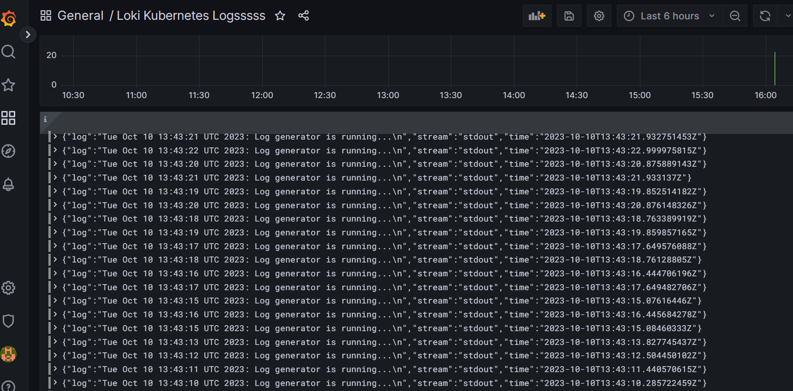

## Monitoring Stack: Promtail, Loki and Grafana

A simple implmenetation of Promtail, Loki and Grafana stack using Docker-Compose on MacOs


<p float="center">
  
</p>


## Pre-requisite

1. [GitHub](https://docs.github.com/en/desktop/installing-and-authenticating-to-github-desktop/installing-github-desktop)
2. [Docker](https://docs.docker.com/engine/install/)

## Run Locally

Clone the project

```bash
  git clone git@github.com:NetOpsChic/promtail-loki-grafana.git
```

Go to the project directory

```bash
  cd promtail-loki-grafana
```

Start the docker engine

```bash
  docker-compose up -d
```
## Screenshots




## Authors

- [@NetOpsChic](https://github.com/NetOpsChic)

## Feedback‚

If you have any feedback, please reach out to us at netopschic@gmail.com
